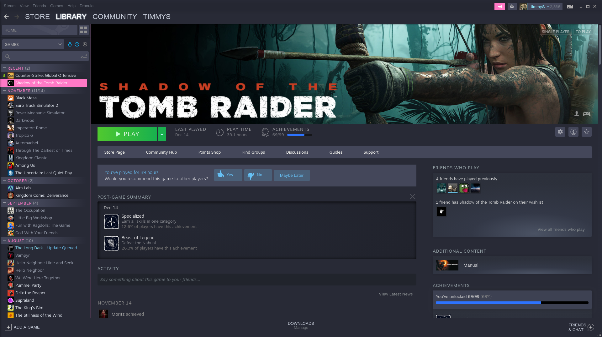

# Dracula for [Steam](https://store.steampowered.com)

> ⚠️ Attention: **Steam** (the platform) **no longer supports themes**, and this repository **no longer has active maintainers**. So it's just a search and reference theme.

> A dark theme for [Steam](https://store.steampowered.com)

  

## Install

Newest Version: 211224  
All installation instructions can be found at [draculatheme.com/steam](https://draculatheme.com/steam).

## Team

This theme is maintained by the following person(s) and a bunch of [awesome contributors](https://github.com/dracula/steam/graphs/contributors).

|  |  |
| ----------------------------------------------------------------------------------------------------- | -------------------------------------------------------------------------------------------------------------- |
| [Trollwut](https://github.com/Trollwut)                                                               | [tintinmaster](https://github.com/tintinmaster)                                                                |

## Community

- [Twitter](https://twitter.com/draculatheme) - Best for getting updates about themes and new stuff.
- [GitHub](https://github.com/dracula/dracula-theme/discussions) - Best for asking questions and discussing issues.
- [Discord](https://draculatheme.com/discord-invite) - Best for hanging out with the community.

## License

[MIT License](./LICENSE)
